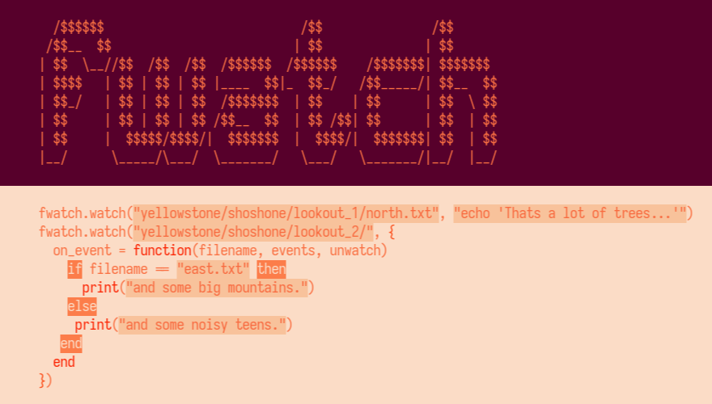

# fwatch.nvim



`fwatch.nvim` lets you watch files or directories for changes and then run vim commands or lua functions.

```lua
fwatch.watch("a_file", "echo 'it changed!'")
fwatch.watch("b_file", {
  on_event = function()
    print("it changed!")
  end
})
```

## Requirements

- Neovim
  - Tested with 0.5, 0.4 probably ok.
- Uses libuv/luv, which may or may not require an inotify (or similar) package to be installed on your OS.
  - May not work on Windows or remote filesystems.

## Installation

Install via any package managment system:

```vim
make_pact 'rktjmp/fwatch.nvim'
```

## Usage

### Watch a file and run a vim command

```lua
local fwatch = require('fwatch')
fwatch.watch("a_file", "echo 'a_file changed'")
```

### Watch a file and run a lua function

```lua
local fwatch = require('fwatch')
fwatch.watch("a_file", {
  on_event = function()
    print('a_file changed')
  end
})
```

### Watch a directory and run a lua function
```lua
local fwatch = require('fwatch')
local limit = 10

fwatch.watch("a_dir", {
  on_event = function(filename, events, unwatch)
    limit = limit - 1
    if limit <= 0 then
      -- *immediately* stop.
      -- without return, the callback would continue executing,
      -- but not be run on the next change.
      print("10 changes, very sleepy.")
      return unwatch()
    end

    print("a_dir/" .. filename .. " was changed")
  end,
  on_error = function(error, unwatch)
    -- disable watcher
    unwatch()
    -- note, print still occurs even though we unwatched *future* events
    print("An error occured: " .. error)
  end
})
```

## API

### `fwatch.watch(path, vim_command_or_function_table)`

> Watch `path`, execute `vim_command_or_function_table` on change or rename. Returns a `handle` to the watcher.

**`path :: string`**

Path to file *or directory* to be watched. `path` may be relative to the current working directory or absolute. `path` **_is not_** expanded, so `~/my_file.txt` **_is not_** expanded to `/home/me/my_file.txt`. You must use existing vim or lua functions to expand paths.

**`vim_command_or_function_table :: string | {on_event :: function, on_error :: function}`**

Either a `string`, which is executed as a vim ex command, or a `table` of callbacks.

The `string` is passed to `vim.cmd` and is automatically prefixed with `:`.

```lua
-- reload colorscheme whenever path changes
fwatch.watch(path, "colorscheme herbert")
```

The `table` *must* contain an `on_event = function` key-value pair, it *may* contain an `on_error = function` key-value pair.

```lua
fwatch.watch(path, {
  on_event = function()
    -- reload colorscheme whenever path changes
    vim.cmd("colorscheme herbert")
  end
})
```

**Callbacks**

**`on_event`**

Called when the watched `path` changes. `on_event` is passed:

- `filename :: string`

  `filename` is the name of the changed file.

- `events :: {change :: boolean, rename :: boolean}`

  `events` describes what type of change occured.

- `unwatch_cb :: function`.

  `unwatch_cb` will detatch the watcher when called.

**`on_error`**

Called when the watcher fails for some reason. `on_error` is passed:

- `error :: string`

  `error` describes the error that occured.

- `unwatch_cb :: function`.

  `unwatch_cb` will detatch the watcher when called.

In lua, function parameters are optional, so you may ignore any you do not need. The following are all valid callbacks:

```lua
on_event = function()
  print("an event")
end
on_event = function(filename)
  print("an event for " .. filename)
end
on_event = function(filename, events, unwatch)
  if events.rename then print(filename .. " was renamed")
  if events.change then print(filename .. " was changed")
  if events.rename and events.change then
    unwatch()
  end
end
```

### `fwatch.once(path, vim_command_or_function_table)`

> Watch `path`, execute `vim_command_or_function_table` on change or rename only once. Returns a `handle` to the watcher. See `fwatch.watch` for more details.

### `fwatch.unwatch(handle)`

> Disables given watcher.

```lua
local handle = fwatch.watch(path, command)
fwatch.unwatch(handle)
```

## Warnings

**Watching a file you edit with vim will likely fire multiple times and detatch your watcher because vim swaps files around on save. See [using inotify/wait along with vim on stackoverflow.](https://unix.stackexchange.com/questions/188873/using-inotifywait-along-with-vim)**

You could call `unwatch()` in every callback and re-call `fwatch.watch()` with the given `filename` to watch the new file.

## Maybe

`:Fwatchers` - show list of watchers?

`:Fwatch "path" "command"` ?

## Artwork

GH image is a play on the cover art for the fantastic game [Firewatch](http://www.firewatchgame.com/) by the brilliant team of [Campo Santo](https://www.camposanto.com/), orignal art at least partly by the talented [Olly Moss](http://ollymoss.com/).
